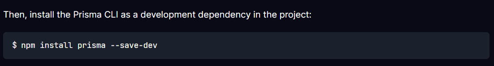
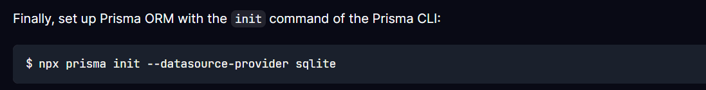

# Projeto Portfólio Full Stack + Agentes de IA - Formação DEV com Leonardo Leitão

### Ferramentas utilizadas no curso

- **[Node.js](https://nodejs.org/pt)**
- **[Visual Studio Code](https://code.visualstudio.com/)**
    - Plugins:
        - Code Runner
        - Docker
        - GitHub Copilot
        - Material Icon Theme
        - PostCSS Language Support
        - Rest Client**
        - **[Prisma](https://www.prisma.io/docs/getting-started/quickstart-sqlite)**
        - Prettier - Code formatter
        - Tailwind CSS IntelliSense
        - Sort Lines
        - Rainbow CSV
- **[Docker](https://www.docker.com/)**
    - Imagem do Docker: n8n
- **[NestJs](https://docs.nestjs.com/)**
- **[Supabase](https://supabase.com/)**
---

## Projeto

Para iniciar o projeto, navegue até a pasta **`core`** e execute o seguinte comando no terminal:

`npm init -y`

No back-end instalar de forma global com o comando `npm i -g @nestjs/cli`, para verificar os comando utilizar `nest --help`

Instalar as dependencias e criar a pasta backend utilizar o comando `nest new backend` e selecionar o gerenciador de pacote `npm` na pasta `.\Portifolio_Nobr3c`

## Teste modo DEV:

Utilizar o comando `npm run start:dev` na pasta backend

Prisma

Na pasta backend rodar o comando `npm install prisma --save-dev`

Para iniciar o Prisma utilizar o comando `npx prisma init` se for utilizar o Sqlite, utilizar o comando a seguir `npx prisma init --datasource-provider sqlite`

Rodar o comando `npx prisma migrate dev` na pasta backend, este comando ira conectar com o SupaBase e aplicar estas migrations 

Dados do Banco obtidos em [Dados](https://github.com/portfolio-projetos-dev/assets)

Criar uma conta no [N8N](https://app.n8n.cloud/register), ferramenta de integração e fluxos

Nest G = nest generate => comando
Na pasta backend rodar os comandos do nest:
    - `nest g module db`
    - `nest g module projeto`
    - `nest g module tecnologia`